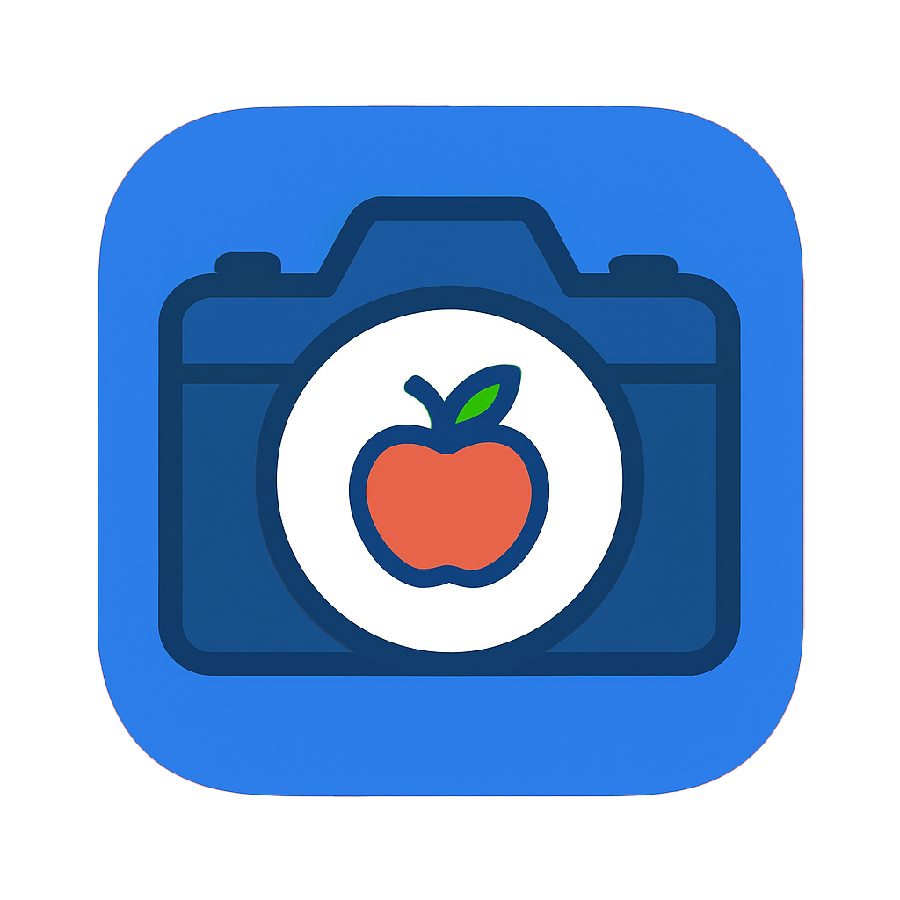

# FoodLens

<p align="center">
  
</p>

[](https://opensource.org/licenses/MIT)
[](https://nodejs.org/)

## Overview

FoodLens helps you scan any food to instantly get nutrition facts, track calories, and manage your diet with ease. Use your camera to scan food labels or ingredients and instantly log calories, macros, and more.

## Table of Contents

- [Features](#features)
- [Tech Stack](#tech-stack)
- [Getting Started](#getting-started)
- [Environment Variables](#environment-variables)
- [Development Roadmap](#development-roadmap)
- [Contributing](#contributing)
- [Contact Information](#contact-information)
- [License](#license)

## Live Demo

**Production Environment:**

- [Live Demo](https://foodlens.up.railway.app)

## Features

- **Food Scanner**: Use your camera to scan your food.
- **Nutrition Tracker**: Instant breakdown of calories, macros, and minerals.
- **Calorie Counter**: Log daily intake, set goals, and view progress charts.
- **Diet Management**: Save scan history and review past meals.
- **Recipe Search**: Browse and fetch recipes.
- **Premium & Credit System**: Enhanced AI scanning for premium users with credit-based access.

## Tech Stack

- **Frontend**: React, Vite, Tailwind CSS, React Query, Chart.js, Recharts
- **Backend (Express)**: Node.js, Express 5, Prisma ORM, Passport (JWT & Google OAuth), Cloudinary, OpenAI SDK
- **Backend (Python)**: Flask, PyTorch, Transformers, Pillow, Waitress/Gunicorn, PyJWT, Hugging Face API
- **Database**: PostgreSQL (via Prisma Client), Supabase
- **Utilities**: Multer, CORS, Express Rate Limiter, Nodemailer
- **Deployment & Hosting**: Railway

## Getting Started

### Prerequisites

- Node.js ≥ 16.0.0
- Python ≥ 3.8
- PostgreSQL
- Cloudinary account
- OpenAI API key
- Hugging Face auth key

### Installation

1. **Clone the repository**

   ```bash
   git clone git@github.com:Etativel/FoodLens.git
   cd FoodLens

   ```

2. **Setup Express Backend**

   ```bash
   cd backend/express
   npm install
   cp .env.example .env
   # Edit .env and add the following keys:
   # DATABASE_URL
   # DIRECT_URL
   # OPENAI_API_KEY
   # JWT_SECRET
   # CLOUDINARY_CLOUD_NAME
   # CLOUDINARY_API_KEY
   # CLOUDINARY_API_SECRET
   # GOOGLE_CLIENT_ID
   # GOOGLE_CLIENT_SECRET
   # GOOGLE_CALLBACK_URL
   # EMAIL_USER
   # EMAIL_PASS
   # FRONTEND_URL

   npx prisma migrate dev --name init
   npm start

   ```

3. **Setup Python Backend**

   ```bash
    cd ../../backend/python
    python -m venv venv
    source venv/bin/activate
    pip install -r requirements.txt
    cp .env.example .env
    # Configure .env: HUGGINGFACE_AUTH_TOKEN, JWT_SECRET
    # Run with Gunicorn:
    gunicorn app:app --workers 4 --bind 0.0.0.0:5000

   ```

4. **Setup Frontend**
   ```bash
    cd ../../frontend
    npm install
    npm run dev
   ```

### Environment Variables

**Express Backend (backend/express/.env):**

- `DATABASE_URL`= PostgreSQL connection string
- `DIRECT_URL`= Direct database URL if separate
- `OPENAI_API_KEY`= OpenAI API key
- `JWT_SECRET`= JWT signing secret
- `CLOUDINARY_CLOUD_NAME`= Cloudinary cloud name
- `CLOUDINARY_API_KEY`= Cloudinary API key
- `CLOUDINARY_API_SECRET`= Cloudinary API secret
- `GOOGLE_CLIENT_ID`= OAuth client ID
- `GOOGLE_CLIENT_SECRET`= OAuth client secret
- `GOOGLE_CALLBACK_URL`= OAuth redirect URL
- `EMAIL_USER`= Gmail address for nodemailer
- `EMAIL_PASS`= Gmail app password
- `FRONTEND_URL`= Frontend application URL

**Python Backend (backend/python/.env):**

- `HUGGINGFACE_AUTH_TOKEN`= Hugging Face auth token
- `JWT_SECRET`= JWT signing secret>

## Development Roadmap

- **May 1–5: Project Kickoff & MVP**

  - Flask API setup for image prediction & pre-trained model
  - Express backend & Vite/React frontend initialization
  - Camera upload, OpenAI vision scan, skeleton component

- **May 6–12: Core Integration & Feature Build-out**

  - Configure Multer + Cloudinary for image storage; proxy JWT cookie to Flask
  - Add recipe endpoints (fetch/upsert) and nutrition field support
  - Build scan storage, intake logs, recipe pages, and calories line chart
  - Introduce scan history view, filtering, and nutrient graphs

- **May 13–19: Authentication, Profiles & UI Components**

  - Add JWT auth, Google OAuth, email verification (nodemailer + verif code table)
  - Implement LoginCode table and password validation
  - Develop user profile provider and settings page
  - Show daily intake chart on home; refine food-card layout and mobile toggles

- **May 20–22: Security, Error Handling & UX Enhancements**

  - Guard sign-in/UI with token checks; rate limiter for token requests
  - Build reset-password flow: token table, request/reset pages, email template
  - Add 404 page, loading spinners, tooltips for credits, and minor layout tweaks
  - Implement cache invalidation for reducing credits

- **May 23: Final Polish & Cleanup**
  - Minor styling refinements across components

## Contributing

Feel free to submit a Pull Request.

1. Fork the repository
2. Create a branch: git checkout -b feature/my-feature
3. Commit your changes: git commit -m 'Add some feature'
4. Push to your branch: git push origin feature/my-feature
5. Open a Pull Request

### Contact Information

- Maintainer: Farhan
- Email: farhanmaulana.dev@gmail.com
- GitHub: https://github.com/Etativel/FoodLens

## License

[MIT](https://github.com/Etativel/Foodlens/blob/main/LICENSE)
